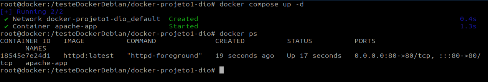
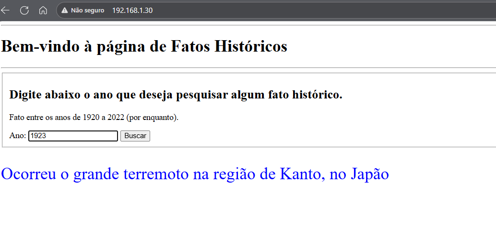

## Resposta Projeto DIO sobre Docker

Este repositório corresponde ao pedido de resposta de projeto sobre docker com um httpd server rodando uma aplicação simples e configuração feita com docker compose.

# Abaixo temos alguns screenshots:
- Terminal

- Navegador em outra máquina
